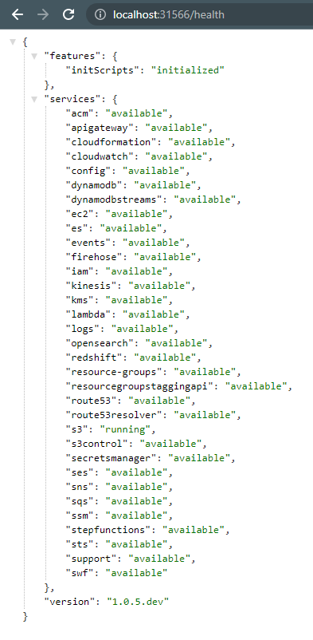
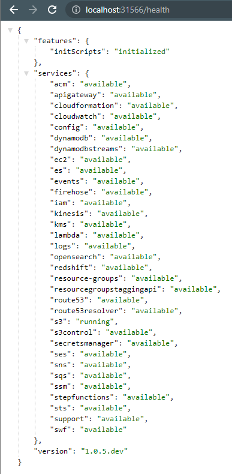
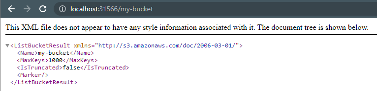
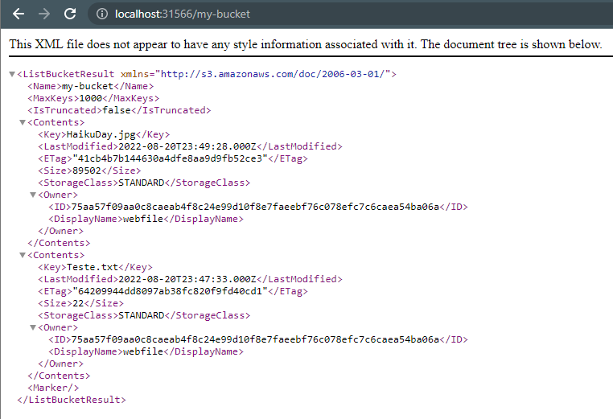
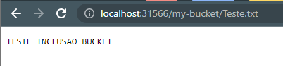
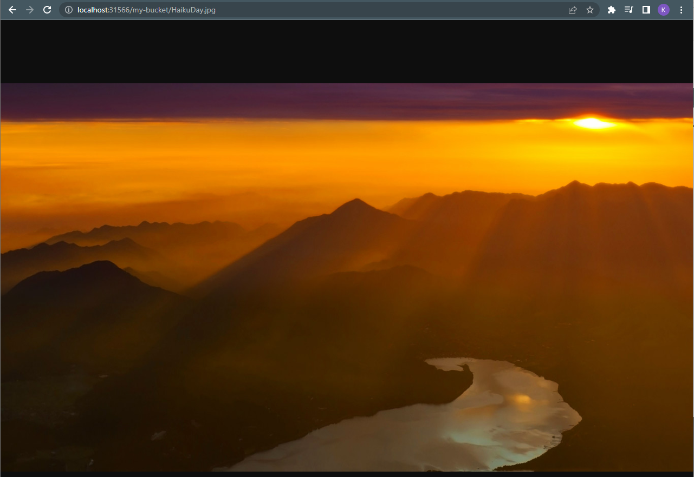

# Localstack Quickstart

- [Localstack Quickstart](#localstack-quickstart)
  - [Utilização pelo Docker](#utilização-pelo-docker)
  - [Utilização pelo Kubernetes](#utilização-pelo-kubernetes)
    - [Subir o Localstack no Kubernetes](#subir-o-localstack-no-kubernetes)
    - [Provisionar o S3 no Localstack](#provisionar-o-s3-no-localstack)
    - [Instalação e configuração do AWS Cli](#instalação-e-configuração-do-aws-cli)
    - [Upload arquivo no S3](#upload-arquivo-no-s3)
    - [Validar arquivo incluído no S3](#validar-arquivo-incluído-no-s3)

Aplicação explicando como subir o Localstack localmente e incluindo um arquivo no S3.

---

## Utilização pelo Docker

---

## Utilização pelo Kubernetes

Para subir o Localstack dentro de um cluster Kubernetes é necessário atender os seguintes requisitos.

- Cluster Kubernetes configurado
- Helm instalado que será utilizado para subir o Localstack
- Terraform configurado para provisionar um recursos da AWS dentro do Localstack

### Subir o Localstack no Kubernetes

Para realizar a instalação do Localstack no cluster Kubernetes é necessário ter o Helm configurado, para isso pode ser baixado diretamente no site do [Helm](https://helm.sh/) ou pode ser utilizado um gerenciado como o [ASDF](https://asdf-vm.com/).

Após a instalação deve ser executado o seguinte comando para adicionar ao Helm o repositório do Localstack.

```helm
helm repo add localstack-repo https://helm.localstack.cloud
```

Depois de adicionar basta executar o seguinte comando para atualizar o Localstack, mas se o mesmo não existir será realizado a instalação.

```helm
helm upgrade --install localstack localstack-repo/localstack
```

Para validar se o Localstack subiu é só realizar a chamada dele pelo browse no path `/health`.



### Provisionar o S3 no Localstack

Depois de instalar o Localstack é necessário configurar o Terraform, para isso é necessário configurar o terraform para execução local (https://docs.localstack.cloud/user-guide/integrations/terraform/).

Com o Terraform instalado, é só executar o comando `tflocal apply` dentro da pasta *kubernetes* para realizar o provisionamento do S3 dentro do Localstack.



Na linha 35 do arquivo *kubernetes/main.tf* está definido que será criado um bucket com o nome *my-bucket*.



Nas linhas 3, 4 e 5 estão as credenciais e a região que deverá ser configurada no *AWS Cli*.

### Instalação e configuração do AWS Cli

Para enviar um arquivo para o S3 é necessário ter o *AWS Cli* instalado e ter configurado as credencias e região. O *AWS Cli* pode ser baixado no próprio site da [AWS](https://aws.amazon.com/pt/cli/) ou pode ser utilizado um gerenciado como o [ASDF](https://asdf-vm.com/).

Com o AWS Cli instalado é só executar o seguinte comando:

```aws
aws configure
```

Em cada um dos campos deve ser informado as credenciais e a região que está no arquivo `main.tf`.

### Upload arquivo no S3

Após a instalação do *AWS Cli*, para enviar um arquivo para o S3 deve se executar o seguinte comando:

Inclusão de arquivo texto

```aws
aws --endpoint-url=http://localhost:31566 s3 cp files/Teste.txt s3://my-bucket
```

Inclusão de imagem

```aws
aws --endpoint-url=http://localhost:31566 s3 cp files/HaikuDay.jpg s3://my-bucket
```

Onde:

- Endpoint-url é a URL para acessar o Localstack
- CP é o comando para copiar um arquivo para o S3 e que deve ser seguido do arquivo a ser enviado e o Bucket

### Validar arquivo incluído no S3

Para validar os arquivos dentro do bucket é só acessar a URL do [S3](http://localhost:31566/my-bucket) para ver a lista de todos os arquivos incluídos no S3 ou executar o seguinte comando:

```aws
aws --endpoint-url=http://localhost:31566 s3 ls s3://my-bucket
```



Para ver o conteúdo do arquivo é só adicionar na URL do bucket o nome do arquivo incluído. Ex.:

- <http://localhost:31566/my-bucket/Teste.txt>
- <http://localhost:31566/my-bucket/HaikuDay.jpg>




